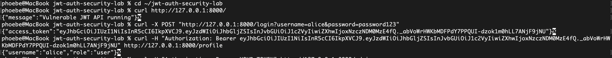
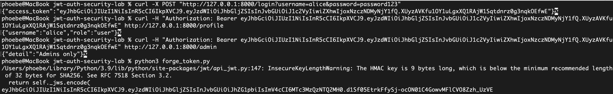
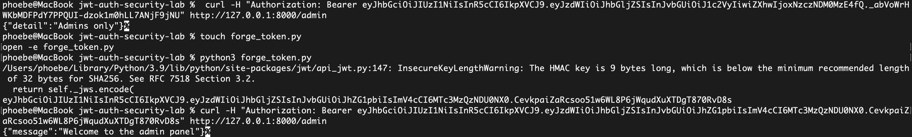
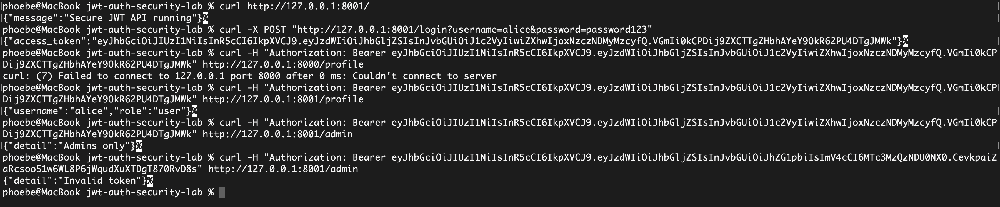

# JWT Authentication Security Lab

A hands-on security lab demonstrating JWT authentication weaknesses, token forgery risk, and secure validation patterns using FastAPI.

## Project Scope

This lab includes:
- a vulnerable JWT API
- a secure JWT API
- token forgery demonstration
- curl-based testing
- screenshots of attack and remediation results

## Files

- `vulnerable_jwt_api.py` — vulnerable implementation
- `secure_jwt_api.py` — remediated implementation
- `forge_token.py` — helper script to simulate forged token creation
- `attack_demo.md` — attack summary and mitigation notes
- `screenshots/` — screenshots of results

## Vulnerability Demonstrated

Weak JWT signing secret leading to token forgery and privilege escalation.

## How to Run

### Vulnerable version

```bash
python3 -m uvicorn vulnerable_jwt_api:app --reload
python3 -m uvicorn vulnerable_jwt_api:app --reload

## Security Test Results

### Vulnerable API – Login and Profile Access


### Token Generation and Attack Setup


### Privilege Escalation via Forged JWT Token


### Secure API – Forged Token Rejected
